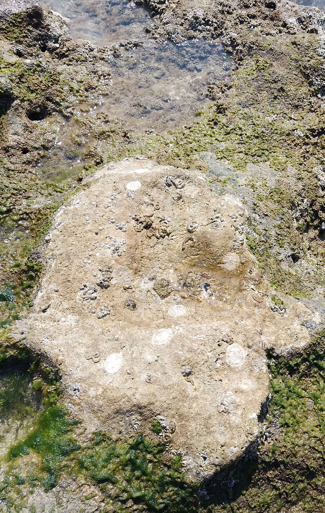
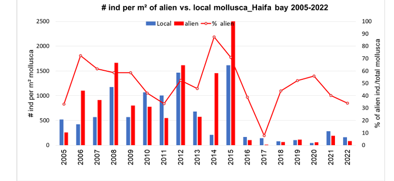

# Comparing Population Dynamics, Behavior and Ecological Role of Native and Invasive Limpets on Israeli Rocky Shores
_A step-by-step field & lab protocol_

## 1  Background
**Patella caerulea** (native) exhibits marked <u>homing</u> behavior and dominates exposed reef edges, whereas the Red-Sea invader **Cellana rota** thrives in warmer, more sheltered micro-habitats. Long-term monitoring in Haifa Bay shows that invaders can now exceed 70 % of all intertidal molluscs in some years.

## 2  Materials
* Waterproof ruler  
* Reef-safe marker pens  
* GPS-enabled camera  
* 25 cm × 25 cm PVC quadrat frame  
* **TRIzol ™ Reagent** for DNA bar-coding – protocol [here](https://assets.thermofisher.com/TFS-Assets%2FLSG%2Fmanuals%2Ftrizol_reagent.pdf)

*Figure 1 – well-defined home scar surrounded by heavily-grazed rock surface.*

## 3  Site Selection
Four sites along Israel’s northern coast (Habonim, Shikmona, Acre, Akhziv) chosen for a gradient in exposure, temperature and invader density.

## 4  Field Survey Procedure
1. At **low tide** lay a quadrat every 5 m along a 50 m transect parallel to shore.  
2. Record GPS, tidal height, surface temperature and photograph each quadrat.  
3. Count and measure all limpets inside the frame (nearest mm).  
4. Mark shells with non-toxic paint for re-sighting.  
5. Repeat monthly for 12 months.

### Sample data sheet
| Date | Site | Quadrat # | _P. caerulea_ (n) | _C. rota_ (n) | Notes |
|------|------|-----------|------------------:|--------------:|-------|
|2025-05-03|Shikmona|1|12|4|Sunny, moderate swell|
|2025-05-03|Shikmona|2|9|6|Sheltered pool|
|2025-05-03|Shikmona|3|15|2|Edge; wave-exposed|
|2025-05-03|Shikmona|4|8|7|Central reef flat|
|2025-05-03|Shikmona|5|11|5|Algal turf dense|
|2025-05-03|Shikmona|6|10|3|Crevice nearby|

## 5  Laboratory Workflow
* **Morphometrics** – measure wet weight & shell dimensions.  
* **DNA bar-coding** – extract < 20 mg tissue → TRIzol™ → PCR (COI) → Sanger.  
* **Biomass** – dry 60 °C, 48 h; weigh to 0.01 g.

*Figure 2 – mixed assemblage of native (white scars) and invasive (darker shells) limpets among filamentous algae.*

## 6  Data Analysis
The long-term dataset (2005 – 2022) below demonstrates the **rapid dominance of alien molluscs** in Haifa Bay:

*Figure 3 – Blue bars = native individuals m⁻², red bars = alien individuals m⁻². The red line shows the % aliens of total mollusca (right-hand axis).*

**Key observations**

| Metric | 2005-2010 | 2011-2016 | 2017-2022 |
|--------|-----------|-----------|-----------|
|Mean % alien (± SD)|46 ± 9 %|74 ± 15 %|42 ± 12 %|
|Peak % year|2006 (82 %)|2015 (97 %)|2020 (58 %)|
|Native density trend|↑ 2005-2012 | ↓ 2013-2016 | flat |

* Alien density peaked at **2 400 ind m⁻²** in 2015, coinciding with a heat-wave summer.  
* Post-2016 decline likely linked to a strong recruitment event of native *P. caerulea* and winter storm scouring.

### Planned statistics
* **Linear mixed model** – Year × Species with Site as random factor.  
* **Breakpoint analysis** – detect regime shifts in % aliens.  
* **Pearson r** – mean SST vs. % aliens (2005-2022).

## 7  References  
1. “Management priorities for marine invasive species.” *Science of the Total Environment* 688: 1028-1040. <https://www-sciencedirect-com.ezproxy.haifa.ac.il/science/article/pii/S0048969719328554>  

2. “Bad neighbors? Niche overlap and asymmetric competition between native and Lessepsian limpets in the Eastern Mediterranean rocky intertidal.” *Marine Pollution Bulletin* 171: 112750. <https://www-sciencedirect-com.ezproxy.haifa.ac.il/science/article/pii/S0025326X21007372>  

3. “Last snail standing? Superior thermal resilience of an alien tropical intertidal gastropod over natives in an ocean-warming hotspot.” *Biological Invasions*. <https://link-springer-com.ezproxy.haifa.ac.il/article/10.1007/s10530-022-02871-x>  
